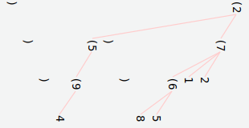

<p align="center" style="margin: 0;">
    
    <h3 align="center">Concise Encoding</h3>
    <p align="center">The secure data format for a modern world</p>
    <hr/>
</p>


💡 Solving the data problems of today
-------------------------------------

**Today's world is very different from the carefree days that brought us XML and JSON:**

### Security

State actors, criminal organizations and mercenaries are now actively hacking governments, companies and individuals to steal secrets, plant malware, and hold your data hostage. The existing ad-hoc data formats are too loosely defined to be secure, and can't be fixed because they're not versioned.

**Concise Encoding is designed from the ground up with security in mind, and is versioned so that it can be updated to handle new threats**.

### Efficiency vs ease-of-use

We send so much data that efficiency is critical, but until now efficiency has meant giving up the ease-of-use of text formats.

**Concise Encoding gives you the best of both worlds with its compatible text and binary formats. Edit text, transmit binary**.

### Types

There's no excuse anymore for not supporting the common data types. Lack of types forces everyone to add extra encoding steps to send their data, which is buggy, reduces compatibility, and makes everything less secure.

**Concise Encoding supports all of the common types natively**.


<br/>

📊 Compared to other formats
-----------------------------

### Features

| Type                  | CE | XML | JSON | BSON | CBOR | Protobufs | Thrift | ASN.1 | Ion |
| --------------------- | -- | --- | ---- | ---- | ---- | --------- | ------ | ----- | --- |
| Int Max Size (bits)   | ∞  | ❌  |  53  |  64  |  64  |    64     |   64   |  64   |  ∞  |
| Float Max Size (bits) | ∞  | ❌  |  64  | 128  |  64  |    64     |   64   |  64   |  ∞  |
| Subsecond Precision   | ns | ❌  |  ❌  |  ns  |  ns  |    ns     |   ❌   |  ns   | ns  |
| Little Endian         | ✔️  | ❌  |  ❌  |  ✔️   |  ❌  |    ✔️      |   ❌   |  ❌   | ❌  |
| Ad-hoc                | ✔️  | ✔️   |  ✔️   |  ✔️   |  ✔️   |    ❌     |   ❌   |  ❌   | ✔️   |
| Non-string map keys   | ✔️  | ❌  |  ❌  |  ✔️   |  ✔️   |    ✔️      |   ❌   |  ❌   | ❌  |
| Size Optimization     | ✔️  | ❌  |  ❌  |  ❌  |  ✔️   |    ❌     |   ❌   |  ✔️    | ❌  |
| Cyclic References     | ✔️  | ❌  |  ❌  |  ❌  |  ✔️   |    ❌     |   ❌   |  ❌   | ❌  |
| Time Zones            | ✔️  | ❌  |  ❌  |  ❌  |  ✔️   |    ❌     |   ❌   |  ❌   | ❌  |
| Bin + Txt             | ✔️  | ❌  |  ❌  |  ❌  |  ❌  |    ❌     |   ❌   |  ❌   | ✔️   |
| Versioned             | ✔️  | ✔️   |  ❌  |  ❌  |  ❌  |    ❌     |   ❌   |  ❌   | ⚠️   |

* **Little Endian**: Modern CPUs use little endian, so little endian formats can be more efficiently encoded/decoded.
* **Ad-hoc**: Supports ad-hoc data (does not require a schema).
* **Size Optimization**: Encoding is designed such that the more common types & values use less space.
* **Cyclic References**: Supports cyclic (recursive) data structures.
* **Time Zones**: Timestamps support real time zones.
* **Bin + Txt**: All types in the binary format match 1:1 to the same type in the text format.
* **Versioned**: Documents are versioned to match a specification version. Ion versioning is in the binary format only.

### Type Support

| Type          | CE | XML | JSON | BSON | CBOR | Protobufs | Thrift | ASN.1 | Ion |
| ------------- | -- | --- | ---- | ---- | ---- | --------- | ------ | ----- | --- |
| Boolean       | ✔️  | ❌  |  ✔️   |  ✔️   |  ✔️   |    ✔️      |   ✔️    |  ✔️    | ✔️   |
| Integer       | ✔️  | ❌  |  ✔️   |  ✔️   |  ✔️   |    ✔️      |   ✔️    |  ✔️    | ✔️   |
| Binary Float  | ✔️  | ❌  |  ❌  |  ✔️   |  ✔️   |    ✔️      |   ✔️    |  ✔️    | ✔️   |
| Decimal Float | ✔️  | ❌  |  ✔️   |  ✔️   |  ✔️   |    ❌     |   ❌   |  ❌   | ✔️   |
| NaN, Infinity | ✔️  | ❌  |  ❌  |  ❌  |  ✔️   |    ✔️      |   ✔️    |  ✔️    | ✔️   |
| UUID          | ✔️  | ❌  |  ❌  |  ✔️   |  ✔️   |    ❌     |   ❌   |  ✔️    | ❌  |
| Timestamp     | ✔️  | ❌  |  ❌  |  ✔️   |  ✔️   |    ✔️      |   ❌   |  ✔️    | ✔️   |
| Resource ID   | ✔️  | ✔️   |  ❌  |  ❌  |  ❌  |    ❌     |   ❌   |  ❌   | ❌  |
| String        | ✔️  | ✔️   |  ✔️   |  ✔️   |  ✔️   |    ✔️      |   ✔️    |  ✔️    | ✔️   |
| Bytes         | ✔️  | ❌  |  ❌  |  ✔️   |  ✔️   |    ✔️      |   ✔️    |  ✔️    | ✔️   |
| List          | ✔️  | ❌  |  ✔️   |  ✔️   |  ✔️   |    ✔️      |   ✔️    |  ✔️    | ✔️   |
| Map           | ✔️  | ❌  |  ✔️   |  ✔️   |  ✔️   |    ✔️      |   ✔️    |  ❌   | ❌  |
| Edge          | ✔️  | ❌  |  ❌  |  ❌  |  ❌  |    ❌     |   ❌   |  ❌   | ❌  |
| Node          | ✔️  | ❌  |  ❌  |  ❌  |  ❌  |    ❌     |   ❌   |  ❌   | ❌  |
| Markup        | ✔️  | ✔️   |  ❌  |  ❌  |  ❌  |    ❌     |   ❌   |  ❌   | ❌  |
| Typed Arrays  | ✔️  | ❌  |  ❌  |  ❌  |  ✔️   |    ✔️      |   ✔️    |  ✔️    | ❌  |
| Reference     | ✔️  | ❌  |  ❌  |  ❌  |  ✔️   |    ❌     |   ❌   |  ❌   | ❌  |
| Remote Ref    | ✔️  | ❌  |  ❌  |  ❌  |  ❌  |    ❌     |   ❌   |  ❌   | ❌  |
| Comment       | ✔️  | ✔️   |  ❌  |  ❌  |  ❌  |    ❌     |   ❌   |  ❌   | ❌  |
| Constant      | ✔️  | ❌  |  ❌  |  ❌  |  ❌  |    ❌     |   ❌   |  ❌   | ❌  |
| Null          | ✔️  | ❌  |  ✔️   |  ✔️   |  ✔️   |    ✔️      |   ❌   |  ✔️    | ✔️   |
| Media         | ✔️  | ❌  |  ❌  |  ❌  |  ❌  |    ❌     |   ❌   |  ❌   | ❌  |
| Custom        | ✔️  | ❌  |  ❌  |  ❌  |  ❌  |    ❌     |   ❌   |  ✔️    | ✔️   |


<br/>

📚 Specifications and Code
---------------------------

### Specifications

 * 🔬 [Concise Encoding Structure](ce-structure.md) (describes the overall structure and rules of the binary and text formats)
 * 📃 [Concise Text Encoding (CTE)](cte-specification.md) (describes the text format)
 * 💽 [Concise Binary Encoding (CBE)](cbe-specification.md) (describes the binary format)

**Note**: Most applications will only need the [binary format](cbe-specification.md). The [text format](cte-specification.md) is only required in places where a human must get involved, and this can often be handled by a simple [command-line tool](https://github.com/kstenerud/enctool).


### Implementations

 * [Go Implementation](https://github.com/kstenerud/go-concise-encoding) (reference implementation)

### Tools

 * [Enctool](https://github.com/kstenerud/enctool) A tool for converting between formats


<br/>

📌 Examples
------------

All examples are valid [Concise Text Encoding](cte-specification.md) documents that can be transparently 1:1 converted to/from [Concise Binary Encoding](cbe-specification.md)

#### Numeric Types

```cte
c1
{
    "boolean"       = true
    "binary int"    = -0b10001011
    "octal int"     = 0o644
    "decimal int"   = -10000000
    "hex int"       = 0xfffe0001
    "very long int" = 100000000000000000000000000000000000009
    "decimal float" = -14.125
    "hex float"     = 0x5.1ec4p+20
    "very long flt" = 4.957234990634579394723460546348e+100000
    "not-a-number"  = nan
    "infinity"      = inf
    "neg infinity"  = -inf
}
```

#### String and String-Like

```cte
c1
{
    "string" = "Strings support escape sequences: \n \t \51F415"
    "url"    = @"https://example.com/"
    "email"  = @"mailto:me@somewhere.com"
}
```

#### Other Basic Types

```cte
c1
{
    "uuid"      = f1ce4567-e89b-12d3-a456-426655440000
    "date"      = 2019-07-01
    "time"      = 18:04:00.948/Europe/Prague
    "timestamp" = 2010-07-15/13:28:15.415942344
    "null"      = null
    "media"     = |application/x-sh 23 21 2f 62 69 6e 2f 73 68 0a 0a
                  65 63 68 6f 20 68 65 6c 6c 6f 20 77 6f 72 6c 64 0a|
}
```

#### Containers

```cte
c1
{
    "list"          = [1 2.5 "a string"]
    "map"           = {"one"=1 2="two" "today"=2020-09-10}
    "bytes"         = |u8x 01 ff de ad be ef|
    "int16 array"   = |i16 7374 17466 -9957|
    "uint16 hex"    = |u16x 91fe 443a 9c15|
    "float32 array" = |f32 1.5e10 -8.31e-12|
}
```

#### Markup

```cte
c1
{
    "main-view" = <View,
        <Image "src"=@"img/avatar-image.jpg">
        <Text "id"="HelloText",
            Hello! Please choose a name!
        >
        // OnChange contains code which might have problematic characters.
        // Use verbatim sequences (\.IDENTIFIER ... IDENTIFIER) to handle this.
        <TextInput "id"="NameInput" "style"={"height"=40 "color"="gray"} "OnChange"="\.@@
            NameInput.Parent.InsertRawAfter(NameInput, '<Image "src"=@"img/check.svg">')
            HelloText.SetText("Hello, " + NameInput.Text + "!")
            @@",
            Name me!
        >
    >
}
```

#### References

```cte
c1
{
    // Entire map will be referenced later as $id1
    "marked object" = &id1:{
        "recursive" = $id1
    }
    "ref1" = $id1
    "ref2" = $id1

    // Reference pointing to part of another document.
    "outside ref" = $"https://xyz.com/document.cte#some_id"
}
```

#### Graphs

```cte
c1
//
// The weighted graph:
//
//     b
//    /|\
//   4 1 1
//  /  |  \
// a-3-c-4-d
//
{
    "vertices" = [
        &a:{}
        &b:{}
        &c:{}
        &d:{}
    ]
    "edges" = [
        @($a {"weight"=4 "direction"="both"} $b)
        @($a {"weight"=3 "direction"="both"} $c)
        @($b {"weight"=1 "direction"="both"} $c)
        @($b {"weight"=1 "direction"="both"} $d)
        @($c {"weight"=4 "direction"="both"} $d)
    ]
}
```

#### Trees

```cte
//
// The tree:
//
//       2
//      / \
//     5   7
//    /   /|\
//   9   6 1 2
//  /   / \
// 4   8   5
//
(2
    (7
        2
        1
        (6
            5
            8
        )
    )
    (5
        (9
            4
        )
    )
)
```

Notice how when rotated 90°, it resembles the tree it represents:



#### Constants

```cte
c1
{
    /* Given: Actual type and value of "eggshell" and
     *        "navy-blue" have been defined in a schema
     */
    "wall color" = #eggshell
    "door color" = #navy-blue
}
```

#### Custom Types

```cte
c1
{
    // Custom types are user-defined, with user-supplied codecs.
    "custom text"   = |ct cplx(2.94+3i)|
    "custom binary" = |cb 04 f6 28 3c 40 00 00 40 40|
}
```
