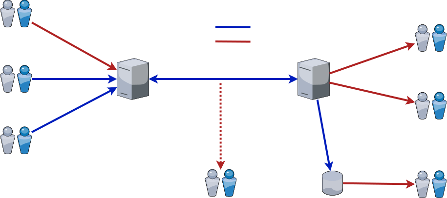
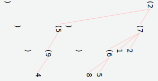

Concise Encoding - Structural Specification
===========================================


Version
-------

Version 0 (prerelease)


This Document
-------------

This document describes the logical structure of the Concise Encoding formats, and the data types it supports.

The actual encoding of the [text (CTE)](cte-specification.md) and [binary (CBE)](cbe-specification.md) formats are described in their respective documents.


Contents
--------

- [Concise Encoding - Structural Specification](#concise-encoding---structural-specification)
  - [Version](#version)
  - [This Document](#this-document)
  - [Contents](#contents)
  - [Terms and Conventions](#terms-and-conventions)
  - [Introduction](#introduction)
    - [What is Concise Encoding?](#what-is-concise-encoding)
    - [Why Two Formats?](#why-two-formats)
    - [Versioning](#versioning)
      - [Prerelease Version](#prerelease-version)
  - [Schema](#schema)
  - [Document Structure](#document-structure)
  - [Document Version Specifier](#document-version-specifier)
  - [Object Categories](#object-categories)
  - [Data Objects](#data-objects)
  - [Numeric Types](#numeric-types)
    - [Boolean](#boolean)
    - [Integer](#integer)
    - [Floating Point](#floating-point)
      - [Supported Bases](#supported-bases)
      - [Decimal Floating Point](#decimal-floating-point)
      - [Binary Floating Point](#binary-floating-point)
      - [Value Ranges](#value-ranges)
      - [Special Floating Point Values](#special-floating-point-values)
      - [NaN Payload](#nan-payload)
    - [UID](#uid)
  - [Temporal Types](#temporal-types)
    - [General Rules](#general-rules)
    - [Date](#date)
    - [Time](#time)
    - [Timestamp](#timestamp)
    - [Time Zones](#time-zones)
      - [Area/Location](#arealocation)
        - [Abbreviated Areas](#abbreviated-areas)
        - [Special Areas](#special-areas)
      - [Global Coordinates](#global-coordinates)
      - [UTC](#utc)
      - [UTC Offset](#utc-offset)
  - [Array Types](#array-types)
    - [String-like Arrays](#string-like-arrays)
      - [NUL Character](#nul-character)
      - [Line Endings](#line-endings)
      - [String (Type)](#string-type)
      - [Resource Identifier (Type)](#resource-identifier-type)
    - [Primitive Array Types](#primitive-array-types)
    - [Media](#media)
    - [Custom Types](#custom-types)
      - [Custom Type Forms](#custom-type-forms)
  - [Container Types](#container-types)
    - [Container Properties](#container-properties)
      - [Ordering](#ordering)
      - [Duplicates](#duplicates)
    - [List](#list)
    - [Map](#map)
      - [Keyable types](#keyable-types)
    - [Struct](#struct)
      - [Struct Instance](#struct-instance)
      - [Struct Validation](#struct-validation)
    - [Edge](#edge)
      - [Example](#example)
    - [Node](#node)
  - [Other Types](#other-types)
    - [Null](#null)
  - [Pseudo-Objects](#pseudo-objects)
    - [Reference](#reference)
      - [Local Reference](#local-reference)
        - [Recursive References](#recursive-references)
      - [Remote Reference](#remote-reference)
  - [Invisible Objects](#invisible-objects)
    - [Comment](#comment)
    - [Padding](#padding)
  - [Structural Objects](#structural-objects)
    - [Struct Template](#struct-template)
    - [Marker](#marker)
    - [Identifier](#identifier)
      - [Identifier Rules](#identifier-rules)
  - [Empty Document](#empty-document)
  - [Character Safety](#character-safety)
  - [Unrepresentable Values](#unrepresentable-values)
    - [Lossy Conversions](#lossy-conversions)
      - [Binary and Decimal Float Conversions](#binary-and-decimal-float-conversions)
    - [Problematic Values](#problematic-values)
  - [Truncated Document](#truncated-document)
  - [Equivalence](#equivalence)
    - [Relaxed Equivalence](#relaxed-equivalence)
      - [Integer and Float Equivalence](#integer-and-float-equivalence)
      - [Custom Type Equivalence](#custom-type-equivalence)
      - [String Equivalence](#string-equivalence)
      - [Array Equivalence](#array-equivalence)
      - [Container Equivalence](#container-equivalence)
      - [Null Equivalence](#null-equivalence)
      - [Comment Equivalence](#comment-equivalence)
      - [Padding Equivalence](#padding-equivalence)
    - [Strict Equivalence](#strict-equivalence)
  - [Error Processing](#error-processing)
    - [Structural Errors](#structural-errors)
    - [Data Errors](#data-errors)
  - [Security and Limits](#security-and-limits)
    - [Attack Vectors](#attack-vectors)
      - [Induced Data Loss](#induced-data-loss)
      - [Default Type Conversions](#default-type-conversions)
      - [Induced Omission](#induced-omission)
      - [Key Collisions](#key-collisions)
      - [Deserialization Complexity](#deserialization-complexity)
      - [Payload Size](#payload-size)
    - [Mitigations: Concise Encoding Codecs](#mitigations-concise-encoding-codecs)
      - [Validation](#validation)
      - [User-Controllable Limits](#user-controllable-limits)
    - [Mitigations: Application Guidelines](#mitigations-application-guidelines)
  - [Appendix A: List of Codec Options](#appendix-a-list-of-codec-options)
    - [Mandatory Options](#mandatory-options)
    - [Mandatory User-controllable limits](#mandatory-user-controllable-limits)
    - [Recommended Options](#recommended-options)
    - [Schema Options](#schema-options)
  - [Appendix B: How to Record Time](#appendix-b-how-to-record-time)
    - [Absolute Time](#absolute-time)
    - [Fixed Time](#fixed-time)
    - [Floating Time](#floating-time)
    - [When to Use Each Kind](#when-to-use-each-kind)
  - [Version History](#version-history)
  - [License](#license)


Terms and Conventions
---------------------

**The following bolded, capitalized terms have specific meanings in this specification**:

| Term             | Meaning                                                                                                               |
| ---------------- | --------------------------------------------------------------------------------------------------------------------- |
| **MUST (NOT)**   | If this directive is not adhered to, the document or implementation is invalid/non-conformant.                        |
| **SHOULD (NOT)** | Every effort should be made to follow this directive, but the document/implementation is still valid if not followed. |
| **MAY (NOT)**    | It is up to the implementation to decide whether to do something or not.                                              |
| **CAN**          | Refers to a possibility which **MUST** be accommodated by the implementation.                                         |
| **CANNOT**       | Refers to a situation which **MUST NOT** be allowed by the implementation.                                            |
| **OPTIONAL(LY)** | The implementation **MUST** support both the existence and the absence of the specified item.                         |
| **OPTION(S)**    | Configuration option(s) that implementations **MUST** provide.                                                        |

**Sample data will generally be represented as follows**:

 * Character sequences are enclosed within backticks: `this is a character sequence`
 * Byte sequences are represented as a series of two-digit hex values enclosed within backticks and square brackets: [`f1 33 91`]
 * Sample Concise Encoding data will usually be given in [CTE format](cte-specification.md) for clarity and human readability.


Introduction
------------

### What is Concise Encoding?

Concise Encoding is a general purpose, human and machine friendly, compact representation of semi-structured hierarchical data. It consists of two parallel and seamlessly convertible data formats: a **binary format** [(Concise Binary Encoding - or CBE)](cbe-specification.md) and a **text format** [(Concise Text Encoding - or CTE)](cte-specification.md).


### Why Two Formats?

Binary formats are more compact and _much_ easier for machines to read and write, but they're also very difficult for _humans_ to read and write (and humans do need to be able to inspect and modify the data from time to time). In the past, we compromised by using text formats (XML, JSON, etc), but text formats are _incredibly_ inefficient, and it's costing us dearly in our new energy conscious world.

"**Human data format that a computer can read**" doesn't work anymore, so Concise Encoding turns it on its head: "**Machine data format that a human can read**". Twin formats make it easy and efficient for machines to read and write data (as binary), and _also_ provide a way for humans to easily and intuitively read and write that same data (as text).

Data should ideally be stored and transmitted in a binary format, and only converted to/from text in the uncommon cases where a human needs to be involved (modifying data, configuring, debugging, etc). In fact, most applications won't even need to concern themselves with the text format at all; a simple standalone command-line tool to convert between CBE and CTE is usually enough for a human to examine and modify the CBE data that your application uses.




### Versioning

Concise Encoding is versioned, meaning that every Concise Encoding document contains the version of the Concise Encoding specification it adheres to. This ensures that any future incompatible changes to the format will not break existing implementations.

The Concise Encoding version is a single positive integer value, starting at 1.

#### Prerelease Version

During the pre-release phase, all documents **SHOULD** use version `0` so as not to cause potential compatibility problems once V1 is released. After release, version 0 will be permanently retired and considered invalid (there shall be no backwards compatibility to the prerelease spec).


Schema
------

Schema research and development is still very much in its infancy. There are currently many schema languages in various stages of maturity, but they tend to focus on specific technologies, formats and use cases, which limits their utility in a general purpose data format:

- [XML DTD](https://www.w3.org/XML/1998/06/xmlspec-report-v20.htm)
- [XML Schema](https://www.w3.org/XML/Schema)
- [RelaxNG](https://relaxng.org/)
- [JSON Schema](https://json-schema.org/)
- [TypeSchema](https://typeschema.org/)
- [JTD](https://datatracker.ietf.org/doc/html/rfc8927)
- [AsyncAPI](https://www.asyncapi.com/)
- [OpenAPI](https://www.openapis.org/)

Although many of these schema technologies could be used to validate CE documents, their limitations would constrain the data and structural design.

The current frontrunner and most agnostic language so far is [CUE](https://cuelang.org/), and although even CUE doesn't fully support all CE types and structural possibilities, it shows the most promise and extensibility.

Therefore, [CUE](https://cuelang.org/) is the preferred schema language for validating Concise Encoding documents.


Document Structure
------------------

Data in a Concise Encoding document is arranged in an ad-hoc hierarchical fashion, stored serially, and can be progressively read or written.

Documents begin with a [version specifier](#document-version-specifier), possibly followed by [invisible](#invisible-objects) and [structural](#structural-objects) objects, and then ultimately followed by one (and only one) top-level [data object](#data-objects).

    [mandatory version specifier] [optional invisible and structural objects] [mandatory top-level data object]

Once the top-level object is fully decoded, the document is considered finished.

[Objects](#object-categories) **MUST NOT** be placed before the version specifier or after the top-level object.

**Notes**:

 * To store multiple [data objects](#data-objects) in a document, use a [container](#container-types) as the top-level object.
 * To represent an [empty document](#empty-document), use [null](#null) as the top-level object.

**Examples**:

 * A document containing a list with the integers 1, 2, 3:
   - In [CTE](cte-specification.md): `c1 [1 2 3]`
   - In [CBE](cbe-specification.md): [`81 01 7a 01 02 03 7b`]
 * An empty document:
   - In [CTE](cte-specification.md): `c1 null`
   - In [CBE](cbe-specification.md): [`81 01 7e`]


Document Version Specifier
--------------------------

The version specifier is composed of a 1-byte type identifier - 0x63 (`c`) for CTE, 0x81 for CBE - followed by the [version number](#version), which is an unsigned integer representing the version of this specification that the document adheres to.

**Example**:

 * [CTE](cte-specification.md) version 1: the character sequence `c1`
 * [CBE](cbe-specification.md) version 1: the byte sequence [`81 01`]


Object Categories
-----------------

Concise Encoding documents support many kinds of objects, the combinations of which offer rich expressivity. These objects are roughly split into four high-level categories based on their purpose:

 * [Data objects](#data-objects) contain the actual data of the document.
 * [Pseudo-objects](#pseudo-objects) serve as stand-ins for [data objects](#data-objects).
 * [Invisible objects](#invisible-objects) provide helper functionality such as comments and alignment, but don't affect the document structure or data.
 * [Structural objects](#structural-objects) provide linkages beween parts of the document and ways to reduce redundancy.


Data Objects
------------

Data objects hold the actual data of a document, and consist mainly of containers and primitives:

 * [Numeric Types](#numeric-types)
 * [Temporal Types](#temporal-types)
 * [Array Types](#array-types)
 * [Container Types](#container-types)
 * [Other Types](#other-types)


Numeric Types
-------------

Numeric types comprise the basic scalar numeric types present in most computer systems.

An implementation **MAY** alter the type and storage size of integer and floating point values when encoding/decoding as long as the resulting value can be converted back to the original value without data loss.

**Note**: The Concise Encoding format itself places no bounds on the range of most numeric types, but implementations (being bound by language, platform, and physical limitations) **MUST** [decide which ranges to accept](#user-controllable-limits). It's important that any limits chosen are kept consistent across all participating systems in order to mitigate potential [security holes](#security-and-limits).


### Boolean

Supports the values true and false.

**Examples (in [CTE](cte-specification.md))**:

```cte
c1
[
    true
    false
]
```


### Integer

Integer values **CAN** be positive or negative, and **CAN** be represented in various bases (in [CTE](cte-specification.md)) and sizes.

**Examples (in [CTE](cte-specification.md))**:

```cte
c1
[
    42
    -1000000000000000000000000000000000000000000000000000
]
```


### Floating Point

A floating point number is conceptually composed of a whole part and a fractional part (forming a significand), multiplied by a base raised to an exponent:

    value = whole.fractional × baseᵉˣᵖᵒⁿᵉⁿᵗ

Internally, the whole and fractional parts are usually combined into a single integer significand value, with the exponent adjusted to compensate:

    value = significand × baseᵉˣᵖᵒⁿᵉⁿᵗ

#### Supported Bases

Concise Encoding supports the two most common bases in use: 10 (decimal) and 2 (binary).

#### Decimal Floating Point

In a decimal floating point number, the exponent represents 10 to the power of the exponent value (for example 3.814 x 10⁵⁰).

Decimal floating point **SHOULD** be the preferred method for storing floating point values because of the rounding issues associated with binary floating point when converting from/to human-friendly forms.

**Examples (in [CTE](cte-specification.md))**:

```cte
c1
[
    -2.81
    4.195342e-10000
]
```

#### Binary Floating Point

In a binary floating point number, the exponent represents 2 to the power of the exponent value (for example 7.403 x 2¹⁵).

Binary floating point is provided mainly to support legacy systems (to ensure that no further rounding occurs when transmitting the values). Concise Encoding supports three types of binary floating point values:

 * [16-bit bfloat](https://en.wikipedia.org/wiki/Bfloat16_floating-point_format)
 * [32-bit ieee754 binary](https://en.wikipedia.org/wiki/Single-precision_floating-point_format)
 * [64-bit ieee754 binary](https://en.wikipedia.org/wiki/Double-precision_floating-point_format)

Following [ieee754-2008 recommendations](https://en.wikipedia.org/wiki/IEEE_754#Binary), the most significant bit of the significand field of a binary NaN (not-a-number) value is defined as the "quiet" bit. When set, the NaN is quiet. When cleared, the NaN is signaling.

    s 1111111 1xxxxxxxxxxxxxxxxxxxxxxx = float32 quiet NaN
    s 1111111 0xxxxxxxxxxxxxxxxxxxxxxx = float32 signaling NaN (if payload is not all zeroes)

**Note**: Be careful not to set the rest of a binary float payload to all zeroes on a signaling NaN, as this signifies [infinity in ieee754-binary, not NaN](https://en.wikipedia.org/wiki/Single-precision_floating-point_format#Exponent_encoding).

**Examples (in [CTE](cte-specification.md))**:

```cte
c1
[
    0xa.3fb8p+42 // a.3fb8 x 2⁴²
    0x1.0p0      // 1
]
```

#### Value Ranges

Floating point types support the following ranges:

| Type    | Significant Digits | Exponent Min | Exponent Max |
| ------- | ------------------ | ------------ | ------------ |
| Binary  | up to 15.95        | up to -1022  | up to 1023   |
| Decimal | ∞                  | -∞           | ∞            |

**Notes**:

 * Binary floats are limited to what is representable by their respective types.
 * Although decimal floats technically have unlimited range, implementations will suffer performance issues after a point, and thus require pragmatic and homogenous [limit enforcement](#user-controllable-limits).

#### Special Floating Point Values

Both decimal and binary floating point numbers have representations for the following special values:

* Two kinds of zero: +0 and -0
* Two kinds of infinities: +∞ and -∞
* Two kinds of NaN (not-a-number): Signaling and quiet

#### NaN Payload

An implementation **MUST** preserve the signaling/quiet status of a NaN, and **MAY** discard the rest of the NaN payload information. Applications **SHOULD NOT** attach special meaning to NaN payloads (other than the quiet bit) because differences in implementation could potentially pose a [security risk](#security-and-limits).


### UID

A universal identifier. This identifier is designed to be unique across all identifiers in the universe.

Concise encoding uses [rfc4122 UUID](https://tools.ietf.org/html/rfc4122) (and future updates to rfc4122) as the universal identifier implementation.

**Example (in [CTE](cte-specification.md))**:

```cte
c1
123e4567-e89b-12d3-a456-426655440000
```


Temporal Types
--------------

Temporal types are some of the most difficult to implement and use correctly. A thorough understanding of how time works physically, politically, conventionally, and socially gets you halfway there. But even then, it's still a veritable minefield that can be your system's undoing if you haven't planned **very** carefully for [the purposes you need to keep time for](#appendix-b-how-to-record-time), and the implications thereof.

Temporal types are represented using the [Gregorian calendar](https://en.wikipedia.org/wiki/Gregorian_calendar) (or the [proleptic Gregorian calendar](https://en.wikipedia.org/wiki/Proleptic_Gregorian_calendar) for dates prior to 15 October 1582) and a [24h clock](https://en.wikipedia.org/wiki/24-hour_clock). Temporal types can have precision to the nanosecond, and also support [leap years](https://en.wikipedia.org/wiki/Leap_year) and [leap seconds](https://en.wikipedia.org/wiki/Leap_second).


### General Rules

 * The `year` field **CANNOT** be 0 (The [Anno Domini](https://en.wikipedia.org/wiki/Anno_Domini) system has no zero year, meaning there is no 0 BC or 0 AD).
 * The sign of the `year` field signifies the era (negative for BC, positive for AD).
 * The `year` field always represents the full year (abbreviations are not allowed).
 * The `month` and `day` fields start counting at 1 (they **CANNOT** be 0).
 * The `day` field **MUST** be valid for the specified month according to the [Gregorian calendar](https://en.wikipedia.org/wiki/Gregorian_calendar#Description).
 * The `day` field **CAN** go up to 29 in Feburary when accommodating a [leap year](https://en.wikipedia.org/wiki/Leap_year).
 * The `hour`, `minute`, `second`, and `subsecond` fields start counting at 0.
 * The `hour` field represents the [24h clock](https://en.wikipedia.org/wiki/24-hour_clock) hour value (there is no AM or PM).
 * The `second` field **CAN** go up to 60 when accommodating a [leap second](https://en.wikipedia.org/wiki/Leap_second).
 * If the time zone is omitted, it is assumed to be `Zero` (aka "Zulu" or "[GMT](https://en.wikipedia.org/wiki/Greenwich_Mean_Time)" or "[UTC](https://en.wikipedia.org/wiki/UTC%C2%B100:00)").


### Date

Represents a date without specifying a time of day.

A date is made up of the following fields:

| Field | Mandatory | Min Value | Max Value |
| ----- | --------- | --------- | --------- |
| Year  |     Y     |        -∞ |        +∞ |
| Month |     Y     |         1 |        12 |
| Day   |     Y     |         1 |        31 |

**Examples (in [CTE](cte-specification.md))**:

```cte
c1
[
    2019-08-05 // August 5, 2019
    5081-03-30 // March 30, 5081
    -300-12-21 // December 21, 300 BC (proleptic Gregorian)
]
```


### Time

Represents a time of day without specifying a particular date.

A time is made up of the following fields:

| Field      | Mandatory | Min Value | Max Value |
| ---------- | --------- | --------- | --------- |
| Hour       |     Y     |         0 |        23 |
| Minute     |     Y     |         0 |        59 |
| Second     |     Y     |         0 |        60 |
| Subseconds |     N     |         0 | 999999999 |
| Time Zone  |     N     |           |           |

**Notes**:

 * Since a time by itself has no date component, its time zone data **MUST** be interpreted as if it were "today". This means that location-based time zones like `America/Seattle` or `48.86/2.36` (as opposed to UTC-offsets like `Zero` or `Etc/GMT+1`) might result in a different absolute time when read on different dates due to political time shifts (such as daylight savings).

**Examples (in [CTE](cte-specification.md))**:

```cte
c1
[
    23:59:59.999999999      // 23:59:59 and 999999999 nanoseconds UTC
    12:05:50.102            // 12:05:50 and 102 milliseconds UTC
    4:00:00/Asia/Tokyo      // 4:00:00 Tokyo time
    17:41:03/-13.54/-172.36 // 17:41:03 Samoa time
    9:00:00/Local           // 9:00:00 local time
]
```


### Timestamp

A timestamp combines a date and a time.

**Examples (in [CTE](cte-specification.md))**:

```cte
c1
[
    2019-01-23/14:08:51.941245                  // January 23, 2019, at 14:08:51 and 941245 microseconds, UTC
    1985-10-26/01:20:01.105/America/Los_Angeles // October 26, 1985, at 1:20:01 and 105 milliseconds, Los Angeles time
    5192-11-01/03:00:00/48.86/2.36              // November 1st, 5192, at 3:00:00, at whatever will be in the place of Paris at that time
]
```


### Time Zones

A time zone refers to the political designation of a location having a specific time offset from UTC at a particular time. Time zones are in a continual state of flux, and could change at any time for many reasons.

Time zone data can be denoted in the following ways:

 * [Area/Location](#arealocation)
 * [Global Coordinates](#global-coordinates)
 * [UTC](#utc)
 * [UTC Offset](#utc-offset)

#### Area/Location

Area/location is the more human-readable method, but might not be precise enough for certain applications. Time zones are partitioned into areas containing locations, and are written in the form `Area/Location`. These areas and locations are specified in the [IANA time zone database](https://www.iana.org/time-zones). Area/Location timezones have a minumum length of 1 character and a maximum length of 127 **bytes** (not characters). They are also case-sensitive because they tend to be implemented that way on most platforms.

**Note**: Some older IANA time zones (mostly deprecated ones) don't follow the `Area/Location` format (for example `MST`, `PST8PDT`). These **MUST** be supported.

**Note**: Some IANA time zones are split into extra sub-components for disambiguation (for example `America/Indiana/Petersburg`, which has area `America` and location `Indiana/Petersburg`). These **MUST** be supported.

See "[Theory and pragmatics of the tz code and data](https://data.iana.org/time-zones/tzdb-2020b/theory.html)" for more information.

##### Abbreviated Areas

Since there are only a limited number of areas in the database, the following abbreviations **CAN** be used in the area portion of the time zone to save space:

| Area         | Abbreviation |
| ------------ | ------------ |
| `Africa`     | `F`          |
| `America`    | `M`          |
| `Antarctica` | `N`          |
| `Arctic`     | `R`          |
| `Asia`       | `S`          |
| `Atlantic`   | `T`          |
| `Australia`  | `U`          |
| `Etc`        | `C`          |
| `Europe`     | `E`          |
| `Indian`     | `I`          |
| `Pacific`    | `P`          |

A Decoder **MUST** convert abbreviated areas back to their full names.

##### Special Areas

The following special pseudo-areas **CAN** also be used. They do not contain a location component.

| Area    | Abbreviation | Meaning            |
| ------- | ------------ | ------------------ |
| `Zero`  | `Z`          | Alias to `Etc/UTC` |
| `Local` | `L`          | "Local" time zone, meaning that the accompanying time value is to be interpreted as if in the time zone of the observer. |

**Note**: These special areas may not be understood by the host's time APIs. Implementations **MUST** compensate for this.

**Examples**:

 * `E/Paris`
 * `America/Vancouver`
 * `Etc/UTC` == `Zero` == `Z`
 * `L`

#### Global Coordinates

The global coordinates method represents the location's global latitudinal and longitudinal position to a precision of hundredths of degrees, giving a resolution of about 1km at the equator.

This method has the advantage of being temporally unambiguous, which could be useful for areas that are in an inconsistent political state at a particular time such that area/location cannot be reliably determined. The disadvantage is that it's not as easily recognizable to humans.

**Examples (in [CTE](cte-specification.md))**:

 * `51.60/11.11`
 * `-13.53/-172.37`

#### UTC

If the time zone is unspecified, it is assumed to be `Zero` (UTC). Placing all past event time values in the UTC time zone has the advantage of more compact and unambiguous time storage, which makes comparisons and other operations much easier and reduces bugs.

UTC time **SHOULD NOT** be used for future or periodic/repeating time values.

#### UTC Offset

Time offset is recorded as an offset (+ or -) from UTC, recorded in hours and minutes (to a maximum of `+2359` and a minimum of `-2359`). This format is not an actual time zone because it doesn't contain location data and therefore cannot account for political shifts (such as daylight savings). In fact, it can't convey any useful information beyond what UTC time can (other than a vague notion of where the value might have originated, and roughly what time of day it was).

Use of UTC offset is discouraged except as a means of interfacing with legacy systems.

UTC offsets **SHOULD NOT** be used for future or periodic/repeating time values.

**Examples (in [CTE](cte-specification.md))**:

 * `+0530`
 * `-0100`


Array Types
-----------

An array represents a contiguous sequence of fixed length elements (essentially a space-optimized [list](#list)). The length of an array is counted in elements (which are not necessarily bytes). The type of the array determines the size of its elements and how its contents are interpreted.

There are four main array styles in Concise Encoding:

 * [String-like arrays](#string-like-arrays) contain UTF-8 data. A string-like array's elements are always 8 bits wide, regardless of how many characters the bytes encode (i.e. the array length is in bytes, not characters).
 * [Primitive array types](#primitive-array-types) represent elements of a fixed size and type.
 * [Media](#media) encapsulates other file formats with well-known media types (which can thus be automatically passed by the application to an appropriate codec). Elements of a media array are always considered to be 8 bits wide, regardless of the actual data the bytes represent.
 * [Custom types](#custom-types) represent custom data structures that only a custom codec designed for them will understand. Elements of a custom type array are always considered to be 8 bits wide, regardless of the actual data the bytes represent.


### String-like Arrays

String-like arrays are arrays of UTF-8 encoded bytes. The following types are string-like arrays:

 * [String](#string-type)
 * [Resource Identifier](#resource-identifier-type)
 * [Remote Reference](#remote-reference)
 * [Custom Type (text form)](#custom-type-forms)

String-like arrays **MUST** always resolve to complete, valid UTF-8 sequences when fully decoded. A string-like array containing invalid or incomplete UTF-8 sequences **MUST** be treated as a [data error](#data-errors).

#### NUL Character

The NUL character (U+0000) is allowed in string-like arrays in documents, but because it is problematic on so many platforms, Concise Encoding imposes a special rule:

 * On platforms that **do not** support NUL in strings, decoders **MUST** convert received NUL characters in string-like arrays to the UTF-8 equivalent [`c0 80`].
 * On platforms that **do** support NUL in strings, decoders **MUST** provide an **OPTION** to convert received NUL characters in string-like arrays to the UTF-8 equivalent [`c0 80`], which **MUST** default to **enabled**.

This ensures a default of uniform behavior across all platforms that sidesteps the null-termination problem.

#### Line Endings

Line endings **CAN** be encoded as LF only (u+000a) or CR+LF (u+000d u+000a) to maintain compatibility with editors on various popular platforms. However, for data transmission the canonical format is LF only.

 * Decoders **MUST** accept both line ending types as input.
 * Encoders **MUST** output LF only.

#### String (Type)

A standard UTF-8 string.

**Example (in [CTE](cte-specification.md))**:

```cte
c1 "I'm just a boring string."
```

#### Resource Identifier (Type)

A resource identifier is a text-based universally unique identifier that can be resolved by a machine. The most common kinds of resource identifiers are [URLs](https://tools.ietf.org/html/rfc1738), [URIs](https://tools.ietf.org/html/rfc3986), and [IRIs](https://tools.ietf.org/html/rfc3987). Validation of a resource ID is done according to its kind. If not specified by a schema, the default kind is assumed.

Codecs **MUST** provide an **OPTION** to set the default kind of resource identifier, and the default setting **MUST** be [IRI](https://tools.ietf.org/html/rfc3987).

**Examples (in [CTE](cte-specification.md))**:

```cte
c1
[
    @"https://x.com/"
    @"mailto:nobody@nowhere.com"
]
```


### Primitive Array Types

A primitive array encodes a sequence of primitive values of a fixed type and size. In a CBE document, the array elements will all be adjacent to each other, allowing large amounts of data to be efficiently copied between the stream and your internal structures.

The following element types are supported in primitive arrays. For other types, use a [list](#list).

| Type                 | Element Sizes (bits) |
| -------------------- | -------------------- |
| Bit                  | 1                    |
| Unsigned Integer     | 8, 16, 32, 64        |
| Signed Integer       | 8, 16, 32, 64        |
| BFloat               | 16                   |
| IEEE754 Binary Float | 32, 64               |
| UID                  | 128                  |

**Examples (in [CTE](cte-specification.md))**:

```cte
c1
[
    |u8x 9f 47 cb 9a 3c|
    |f32 1.5 0x4.f391p100 30 9.31e-30|
    |i16 0b1001010 0o744 1000 0x7fff|
    |u 3a04f62f-cea5-4d2a-8598-bc156b99ea3b 1d4e205c-5ea3-46ea-92a3-98d9d3e6332f|
    |b 1 1 0 1 0|
]
```


### Media

A media object encapsulates foreign media data (encoded as a binary stream), along with its [media type](http://www.iana.org/assignments/media-types/media-types.xhtml) (encoded as a string).

    [media type] [data]

The media object's internal encoding is not the concern of a Concise Encoding codec; CE merely sees the data as a sequence of bytes with an associated media type, and passes it along as such.

Codecs **MUST NOT** attempt to validate the media type beyond ensuring that it contains only the allowed character range described in [rfc6838](https://www.rfc-editor.org/rfc/rfc6838.html#section-4.2). An unrecognized media type is **not** a decoding error; it is the application layer's job to decide such things.

**Note**: [Multipart types](https://www.iana.org/assignments/media-types/media-types.xhtml#multipart) are **not** supported.

**Example (in [CTE](cte-specification.md))**:

```cte
c1
|m application/x-sh 23 21 2f 62 69 6e 2f 73 68 0a 0a 65 63 68 6f 20 68 65 6c 6c 6f 20 77 6f 72 6c 64 0a|
```

Which is the shell script:

```sh
#!/bin/sh

echo hello world
```


### Custom Types

There are some situations where a custom data type is preferable to the standard types. The data might not otherwise be representable, or it might be too bulky using standard types, or you might want the data to map directly to/from memory structs for performance reasons.

Adding custom types restricts interoperability to only those implementations that understand the types, and **SHOULD** only be used as a last resort. An implementation that encounters a custom type it doesn't know how to decode **MUST** report it as a [data error](#data-errors).

**Note**: Although custom types are encoded as "array types", the interpretation of their contents is user-defined, and they likely won't represent an array at all.

#### Custom Type Forms

Custom types can be represented in binary and textual form, where the binary form is encoded as a series of bytes, and the textual form is a structured textual representation.

[CBE](cbe-specification.md) documents only support the binary form. [CTE](cte-specification.md) documents support both the binary and textual forms. CTE encoders **MUST** output the textual form if it's available.

Custom type implementations **MUST** provide at least a binary form, and **SHOULD** also provide a textual form. When both binary and textual forms of a custom type are provided, they **MUST** be 1:1 convertible to each other without data loss.

**Example**:

Suppose we wanted to encode a fictional "complex number" type:

    typedef complex
    {
        real:      float32
        imaginary: float32
    }

For our textual encoding scheme, we could represent complex numbers using something like this: `cplx(REAL+IMAGINARYi)`, where `REAL` and `IMAGINARY` are floats.

For our binary encoding scheme, we could just write the two float32 values directly. However, we might find later on that we need more than one custom type, so it's a good idea to include a type field as the first byte to differentiate it from any future types we might add later (let's choose type `1` to represent our complex type).

Our data sequence is therefore:

    [type: uint8] [real: float32] [imaginary: float32]

     01 78 56 34 12 78 56 34 12 <-- in little endian byte order
     || |---------| |---------|
    type   real      imaginary

**Note**: It's a good idea to store multibyte primitive binary types in little endian byte order since that's what all modern CPUs use natively.

With the above encoding scheme, a complex number such as 2.94 + 3i would be represented as follows:

Our data:

 * Type: `1`
 * Real: `2.94`, float32 bit pattern `0x403c28f6`, in little endian `f6 28 3c 40`
 * Imaginary: `3`, float32 bit pattern `0x40400000`, in little endian `00 00 40 40`

In [CTE](cte-specification.md):

 * Binary form: `|c 01 f6 28 3c 40 00 00 40 40|`
 * Textual form: `|c "cplx(2.94+3i)"|`

In [CBE](cbe-specification.md):

 * Binary form: [`92 12 01 f6 28 3c 40 00 00 40 40`]
 * Textual form not supported in CBE


Container Types
---------------

Container types hold collections of other objects.


### Container Properties

#### Ordering

If a container is ordered, the order in which objects are placed in the container matters. Ordered containers that contain [equivalent](#equivalence) objects but in a different order are NOT [equivalent](#equivalence).

#### Duplicates

For list-like containers, a duplicate means any object that is [equivalent](#equivalence) to another object already present in the list.

For map-like containers, a duplicate means any key-value pair whose key is [equivalent](#equivalence) to another key already present in the map, regardless of what the key's associated value is.

An implementation **MUST** disregard the type and size of integers and floats when comparing them to one other. If they can be converted to one another without data loss, they are potential duplicates. For example, the 16-bit integer value `2000`, the 64-bit integer value `2000`, and the 32-bit float value `2000.0` are all considered duplicates. The string value `"2000"`, however, is not a duplicate because it is a string, not an integer or float.

If a container disallows duplicates, duplicate entries are [structural errors](#structural-errors).

Ordering and duplicates policies in [lists](#list) and [maps](#map) **CAN** be set by a schema, per-instance and globally.


### List

A sequential list of objects. List elements **CAN** be any type (including other containers), and do not all have to be the same type.

By default, a list is [ordered and allows duplicate values](#container-properties).

**Example**:

```cte
c1
[
    1
    "two"
    3.1
    {}
    null
]
```


### Map

A map associates key objects with value objects. Keys **CAN** be any [keyable type](#keyable-types), and do not have to all be the same type. Values **CAN** be any type (including other containers), and do not have to all be the same type.

Map entries are stored as key-value pairs. A key without a paired value is a [structural error](#structural-errors).

By default, a map is [unordered and does not allow duplicate keys](#container-properties).

#### Keyable types

Only the following types are allowed as keys in map-like containers:

* [Numeric types](#numeric-types), except for NaN (not-a-number)
* [Temporal types](#temporal-types)
* [Strings](#string-type)
* [Resource identifiers](#resource-identifier-type)
* [References](#reference) (only if the referenced value is keyable)

**Example (in [CTE](cte-specification.md))**:

```cte
c1
{
    1 = "alpha"
    2 = "beta"
    "a map" = {"one"=1 "two"=2}
    2000-01-01 = "New millenium"
}
```


### Struct

A struct produces a [map](#map) from a template. Structs are composed of two parts: a [struct template](#struct-template) which defines what keys will be present, and [struct instances](#struct-instance) that combine the template's keys with a series of values to produce [maps](#map).

    Struct Template: <key1 key2 key3 ...>
    Struct Instance: (val1 val2 val3 ...)
    ----------------------------------------------------
    Produces Map:    {key1=val1 key2=val2 key3=val3 ...}

Structs offer a more efficient way to encode payloads containing many instances of the same data structures by removing the need to write their map keys over and over. For tabular data this can reduce the payload size by 30-50% or more.

#### Struct Instance

A struct instance builds a [map](#map) from a [struct template](#struct-template) by assigning the values from the instance to the keys from the template.

A struct instance contains the [identifier](#identifier) of the [struct template](#struct-template) to build from, followed by a series of values that will be assigned in-order to the keys from the template.

 * Struct instances are always [ordered, and **CAN** contain duplicates](#container-properties).
 * The struct instance **MUST** define the same number of values as there are keys in the struct template. A mismatch is a [structural error](#structural-errors).
 * A struct instance **CANNOT** be placed before the [template](#struct-template) it references.

**Example (in [CTE](cte-specification.md))**:

```cte
c1
{
    "year end" = 2018
    "vehicles" = [
        @vehicle<"make"       "model"      "drive" "sunroof">
        @vehicle("Ford"       "Explorer"   "4wd"   true     )
        @vehicle("Toyota"     "Corolla"    "fwd"   false    )
        @vehicle("Honda"      "Civic"      "fwd"   false    )
        @vehicle("Alfa Romeo" "Giulia 952" "awd"   true     )
    ]
    "phones" = [
        @phone<"make"   "model"      "storage">
        @phone("Apple"  "iPhone XS"   67108864)
        @phone("Google" "Pixel 3 XL" 134217728)
    ]
}
```

The above document is equivalent to:

```cte
c1
{
    "year end" = 2018
    "vehicles" = [
        {
            "make" = "Ford"
            "model" = "Explorer"
            "drive" = "4wd"
            "sunroof" = true
        }
        {
            "make" = "Toyota"
            "model" = "Corolla"
            "drive" = "fwd"
            "sunroof" = false
        }
        {
            "make" = "Honda"
            "model" = "Civic"
            "drive" = "fwd"
            "sunroof" = false
        }
        {
            "make" = "Alfa Romeo"
            "model" = "Giulia 952"
            "drive" = "awd"
            "sunroof" = true
        }
    ]
    "phones" = [
        {
            "make" = "Apple"
            "model" = "iPhone XS"
            "storage" = 67108864
        }
        {
            "make" = "Google"
            "model" = "Pixel 3 XL"
            "storage" = 134217728
        }
    ]
}
```

#### Struct Validation

As struct templates and instances are only parts of the final object, they **CANNOT** be validated on their own; only the final [map](#map) they produce **CAN** be validated.


### Edge

An edge describes a relationship between vertices in a graph. It is composed of three parts:

 * A **source**, which is the first vertex of the edge being described. This will most commonly be either a [reference](#reference) to an existing object, or a [resource ID](#resource-identifier-type). This **MUST NOT** be null.
 * A **description**, which describes the relationship (edge) between the source and destination. This implementation-dependent object can contain information such as weight, directionality, or other arbitrary data. If the edge has no properties, use [null](#null).
 * A **destination**, which is the second vertex of the edge being described. This **MUST NOT** be null.

If any of these parts are missing, it is a [structural error](#structural-errors).

Directionality is from the source to the destination unless the description or schema specifies otherwise.

Because graphs can take so many forms, there is no default interpretation for edges. Both sender and receiver **MUST** have a common understanding of what the graph edges represent, and how to interpret the data. For directed graphs with no edge descriptions, it's better to use [nodes](#node) instead.

#### Example

Edges can describe many kinds of graphs, even [RDF-style](https://en.wikipedia.org/wiki/Resource_Description_Framework) edges of a semantic graph (where the source, description and destination represent the subject, predicate and object of the semantic relationships):

```cte
c1
[
    @(
        @"https://springfield.gov/people#homer_simpson"
        @"https://example.org/wife"
        @"https://springfield.gov/people#marge_simpson"
    )
    @(
        @"https://springfield.gov/people#homer_simpson"
        @"https://example.org/employer"
        @"https://springfield.gov/employers/nuclear_power_plant"
    )
]
```

From the above data, we understand that Homer Simpson's wife is Marge Simpson, and that Homer Simpson's employer is the nuclear power plant.

More complex graph data can be succinctly represented by mixing in other CE features such as [references](#reference), [lists](#list), and [maps](#map).

```cte
c1
{
    @"https://springfield.gov/people#homer_simpson" = {
        @"https://mypredicates.org/wife" = @"https://springfield.gov/people#marge_simpson"
        @"https://mypredicates.org/regrets" = [
            $firing
            $forgotten_birthday
        ]
        @"https://mypredicates.org/troubles" = $troubles
    }

    "graph edges" = [
        &marge_birthday:@(
            @"https://springfield.gov/people#marge_simpson"
            @"https://mypredicates.org/birthday"
            1956-10-01
        )
        &forgotten_birthday:@(
            @"https://springfield.gov/people#homer_simpson"
            @"https://mypredicates.org/forgot"
            $marge_birthday
        )
        &firing:@(
            @"https://springfield.gov/people#montgomery_burns"
            @"https://mypredicates.org/fired"
            @"https://springfield.gov/people#homer_simpson"
        )

        // Multiple subjects
        &troubles:@(
            [$firing $forgotten_birthday]
            @"https://mypredicates.org/contribute"
            @"https://myobjects.org/marital_strife"
        )
    ]
}
```


### Node

A node is the basic building block for unweighted directed graphs. It consists of:

 * A value (any object).
 * An [ordered](#container-properties) collection of zero or more children (directionality is always from the node to its children).

If a child is not of type node, it is treated as though it were the value portion of a node with no children.

**Hint**: If the graph is cyclic, use [references](#reference) to nodes to represent the cycles.

Nodes are recorded in a **depth-first**, **node-right-left** order, which ensures that the [CTE](cte-specification.md) representation looks like the actual tree structure it describes when rotated 90 degrees clockwise.

**Example (in [CTE](cte-specification.md))**:

```cte
c1
// The tree:
//       2
//      / \
//     5   7
//    /   /|\
//   9   6 1 2
//  /   / \
// 4   8   5
//
(2
    (7
        2
        1
        (6
            5
            8
        )
    )
    (5
        (9
            4
        )
    )
)
```

When rotated 90 degrees clockwise, one can recognize the tree structure this represents:




Other Types
------------

### Null

Null signals that the specified field or index is absent. It is used to support data operations that would otherwise be difficult to indicate.

Some uses for null in common operations:

| Operation | Meaning when field value = null                                         |
| --------- | ----------------------------------------------------------------------- |
| Create    | From client: Do not create this field (overrides any default value).    |
| Read      | From server: This field has been removed since the previous checkpoint. |
| Update    | From client: Remove this field.                                         |
| Delete    | From client: Match records where this field is not present.             |
| Fetch     | From client: Match records where this field is not present.             |


Pseudo-Objects
--------------

Pseudo-objects are not [data objects](#data-objects) themselves, but rather stand in for [data objects](#data-objects).

Pseudo-objects **CAN** be placed anywhere a [data object](#data-objects) can be placed, except inside a [primitive array's](#primitive-array-types) contents (for example, `|u8x 11 22 $myref 44|` is invalid).


### Reference

A reference acts as a stand-in for another object in the current document or another document. It functions much like a pointer or reference would in a programming language, offering ways to:

 * Reduce repetitive information.
 * Encode cyclic data (recursive references).

#### Local Reference

A local reference contains the marker [identifier](#identifier) of an object that has been [marked](#marker) elsewhere in the current document.

 * Recursive references (reference causing a cyclic graph) are supported only if the implementation has been configured to accept them.
 * Forward references (reference to an object marked later in the document) are supported.
 * A local reference **MUST** point to a valid [marked object](#marker) that exists in the current document. A reference with an invalid marker ID is a [structural error](#structural-errors).
 * A local reference used as a map key **MUST** refer to a [keyable type](#keyable-types).

##### Recursive References

Because cyclic graphs are potential denial-of-service attack vectors to a system unprepared to handle such data, implementations **MUST** provide a configuration **OPTION** to enable recursive references, and this option **MUST** default to disabled.

When support is disabled, a recursive local reference is a [structural error](#structural-errors).

**Examples (in [CTE](cte-specification.md))**:

```cte
c1
{
    "some object" = {
        "some string" = &my_string_ref:"This is my string"
        "some map" = &my_map_ref:{
            "a" = 1
        }
    }

    "forward reference" = $later_obj_ref
    "reference to string" = $my_string_ref
    "reference to map" = $my_map_ref

    "a later object" = &later_obj_ref:{
        "x" = 2
        "recursive reference" = $later_obj_ref
    }
}
```

#### Remote Reference

A remote reference refers to an object in another document. It acts like a [resource ID](#resource-identifier-type) that describes how to find the referenced object in an outside document.

 * A remote reference **MUST** point to either:
   - Another Concise Encoding document (using no fragment section, thus referring to the top-level object in the document)
   - A [marker identifier](#marker) inside of another Concise Encoding document, using the fragment section to specify the [marker identifier](#marker) in the document being referenced.
 * A remote reference **MUST NOT** be used as a map key because there's no way to know if it refers to a keyable type without actually following the reference (which would slow down evaluation and poses a security risk).
 * Because remote links pose security risks, implementations **MUST NOT** follow remote references unless explicitly configured to do so. If an implementation provides a configuration option to follow remote references, it **MUST** default to disabled.
 * If automatic remote reference following is enabled, a remote reference that doesn't resolve to a valid Concise Encoding document or valid [marker identifier](#marker) inside the document is a [structural error](#structural-errors).

**Examples (in [CTE](cte-specification.md))**:

```cte
c1
{
    "ref to doc on filesystem" = $"some_document.cbe"
    "ref to marked obj in local doc" = $"some_document.cbe#widgets" // Refers to the marked object "widgets" in document some_document.cbe
    "ref to remote doc" = $"https://somewhere.com/my_document.cbe"
    "ref to marked obj in remote doc" = $"https://somewhere.com/my_document.cbe#widgets"
}
```


Invisible Objects
-----------------

Invisible objects are "invisible" to the structure of the document (they have no semantic relevance and could be removed without affecting the structure or data of the document). They provide utility functionality for convenience when building a document.

Invisible objects may not be available in both text and binary formats.

Invisible objects **CANNOT** be used as real objects, and **CANNOT** be marked or referenced; they are completely invisible to the document structure.


### Comment

A comment is a string-like invisible object that provides extra information for human readers in CTE documents. CBE documents do not support comments.

CTE supports two forms of comments:

 * Single-line comments, which end at the line end (`// a comment`).
 * Multi-line comments, which can span multiple lines of text, and support nesting (`/* a comment */`).

Comments are allowed anywhere in a CTE document where a real object would be allowed, and can also be placed in [primitive arrays](#primitive-array-types) alongside array elements (but not between the opening pipe and the [array type specifier](cte-specification.md#primitive-type-array-encoding)).

**Examples (in [CTE](cte-specification.md))**:

```cte
c1
// Comment before top-level object
{
    // Comment before the "name" object.
    // And another comment.
    "name" = "Joe Average" // Comment after the "Joe Average" object.

    "email" = // Comment after the "email" key.
    /* Multiline comment with nested comment inside
      @"mailto:joe@average.org"
      /* Nested multiline
         comments are allowed */
    */
    @"mailto:someone@somewhere.com"

    "a" = "We're inside a string, so /* this is not a comment; it's part of the string! */"

    "data" =
    // A comment before some binary data
    |u8x // Comment at the start of the array
         01 02 03 // A comment inside the binary array
         04 05 06 07 /* Another comment inside */ 08 09 0a
         /* One more before closing */|

    // Comment before the end of the top-level object (the map), but not after!
}
```


### Padding

Padding is an invisible object used for aligning data in a CBE document, and has no actual meaning. CTE encoders **CANNOT** encode padding.

The padding type **CAN** occur any number of times where a [CBE type field](cbe-specification.md#type-field) is valid.


Structural Objects
------------------

Structural objects exist purely in support of the document structure itself. They have no meaning outside of the document.

Structural objects do not represent data, and **CANNOT** be [marked](#marker).


### Struct Template

A struct template provides instructions for a decoder to build instances from, defining what keys will be present for any [struct instances](#struct-instance) that use it.

A struct template contains a unique (to the current document) template [identifier](#identifier), followed by a series of keys that will be present in any instances created from it.

 * Templates are always [ordered, and **CANNOT** contain duplicate keys](#container-properties).
 * Template keys **MUST** be [keyable types](#keyable-types), and **CANNOT** be [references](#reference).
 * Templates **CAN** be placed anywhere a [pseudo-object](#pseudo-objects) can, and also any number of times before the [top-level object](#document-structure), but there are some restrictions:
   - Templates **CANNOT** be placed inside other templates.
   - A Template **MUST** be defined **before** any [struct instances](#struct-instance) that use it.


### Marker

A marker assigns a unique (to the current document) marker [identifier](#identifier) to another object, which is then [referenceable](#reference) from anywhere the document (or from a different document).

    [marker identifier] [marked object]

A marker **CAN ONLY** be attached to a [data object](#data-objects) (e.g. `&my_marker1:&my_marker2:"abc"` and `&my_marker1:$my_marker2` are invalid).

Other objects **CANNOT** be placed between a marker and the object it marks, regardless of type (e.g. `&my_id:/*comment*/123456` is invalid).

**Example (in [CTE](cte-specification.md))**:

```cte
c1
[
    &remember_me:"Remember this string"
    &1:{"a" = 1}
]
```

The string `"Remember this string"` is marked with the ID `remember_me`, and the map `{"a"=1}` is marked with the ID `1`.


### Identifier

Identifiers provide the linkage mechanism between objects.

Identifiers are always an integral part of another type, and thus **CANNOT** exist standalone, and **CANNOT** be preceded by [pseudo-objects](#pseudo-objects) or [invisible objects](#invisible-objects) (e.g. `&/* comment */mymarker:"Marked string"` is invalid).

Identifier definitions **MUST** be unique to the type they identify for in the current document. So for example the [marker](#marker) ID "a" will not clash with the [struct template](#struct-template) ID "a", but a document **CANNOT** contain two [markers](#marker) with ID "a" or two [struct templates](#struct-template) with ID "a".

#### Identifier Rules

 * It **MUST** be a valid, visible UTF-8 string and contain only [identifier safe](#character-safety) characters.
 * It **MUST** be from 1 to 127 (inclusive) **bytes** (not characters) long.
 * Comparisons are **case insensitive**.


Empty Document
--------------

An empty document is signified by using the [Null](#null) type as the [top-level object](#document-structure):

* In CBE: [`81 01 7e`]
* In CTE: `c1 null`


Character Safety
----------------

Because [CTE](cte-specification.md) documents **MUST** be editable by a human without losing information, there are certain codepoints that **MUST NOT** be present in a [CTE](cte-specification.md) document. These restrictions can be worked around in some contexts by encoding them as [escape sequences](cte-specification.md#escape-sequences).

All unassigned, reserved, and invalid Unicode codepoints **MUST NOT** be present in a [CBE](cbe-specification.md) or [CTE](cte-specification.md) document at all (even in escaped form).

[Identifiers](#identifier) have even stricter restrictions, and do not support [escape sequences](cte-specification.md#escape-sequences).

The following table lists the CTE and identifier safety of Unicode characters based on [category](https://unicode.org/glossary/#general_category) or codepoint. The more specific categories or codepoints override the safety status of the broader categories in the range they specify. All characters not covered by this table are both CTE _and_ identifier **unsafe**.

| Category or Character | CTE Safe? | Identifier Safe? |
| --------------------- | --------- | ---------------- |
| Cf (format)           |     Y     |        Y         |
| L (letter)            |     Y     |        Y         |
| M (mark)              |     Y     |        Y         |
| N (number)            |     Y     |        Y         |
| P (punctuation)       |     Y     |        -         |
| S (symbol)            |     Y     |        -         |
| Zs (space separators) |     Y     |        -         |
| U+0009 (TAB)          |     Y     |        -         |
| U+000a (LF)           |     Y     |        -         |
| U+000d (CR)           |     Y     |        -         |
| U+002d (`-`)          |     Y     |        Y         |
| U+002e (`.`)          |     Y     |        Y         |
| U+005f (`_`)          |     Y     |        Y         |
| U+00ad (SHY)          |     -     |        -         |
| U+200b (ZWSP)         |     -     |        -         |
| U+200e to U+200f      |     -     |        -         |
| U+202a to U+202e      |     -     |        -         |
| U+2060 to U+206f      |     -     |        -         |
| U+feff (BOM)          |     -     |        -         |
| U+fff9 to U+fffb      |     -     |        -         |
| U+e0001 to U+e0007f   |     -     |        -         |


Unrepresentable Values
----------------------

Although Concise Encoding strives to support the most common and fundamental information types, there's no guarantee that all values of all types will be representable on a particular platform.

Decoders are given a lot of leeway in how they represent a document's data after decoding in order to minimize these sorts of problems, but there will sometimes be situations where there is no type available that can represent the value. If a value in a Concise Encoding document cannot be represented in the designated type on the destination platform or in any acceptable substitute type without data loss, it **MUST** be processed according to the [lossy conversion rules](#lossy-conversions).


### Lossy Conversions

If, after decoding and storing a value, it is no longer possible to encode it back into the exact same bit pattern due to data loss, the conversion is considered to be "lossy".

**Lossy conversions that MUST be allowed**:

 * Loss of [NaN payload data](#nan-payload), except for the quiet bit which **MUST** be preserved

**Lossy conversions that MUST NOT be allowed**:

 * String character substitution or omission
 * Truncation from storing in a type that cannot hold all of the data (except where decided based on configuration - see below)

**Lossy conversions that MUST be decided based on configuration**:

 * Loss of floating point coefficient precision from conversion between binary and decimal float types
 * Loss of floating point coefficient precision from storing in a smaller float type
 * Loss of subsecond precision due to temporal type mismatch or platform capabilities
 * Conversion from a real [time zone](#time-zones) to a [UTC offset](#utc-offset)

Implementations **MUST** provide a configuration **OPTION** for each configurable lossy conversion that can occur on its platform, and each option **MUST** default to disabled.

Disallowed lossy conversions are [data errors](#data-errors).

#### Binary and Decimal Float Conversions

Binary and decimal float values can rarely be converted to each other without data loss, but conversions are sometimes necessary:

 * The destination platform might not support the requested type.
 * The struct being decoded into might only have a partially compatible type.

Conversion between binary and decimal float values **MUST** be done using a method that effectively produces the same result in the destination type as the following algorithm would:

1. Convert the source value to its string-based decimal float encoding.
2. Convert the string value into the destination type.

Where conversion between binary float and decimal string representation follows one of the commonly accepted conversion algorithms present in most standard libraries, for example:

 * Jerome T. Coonen: "An Implementation Guide to a Proposed Standard for Floating-Point Arithmetic." Computer, Vol. 13, No. 1, January 1980, pp. 68-79
 * Guy. L. Steele Jr. and J. L. White: "How to print floating-point numbers accurately". In proceedings of ACM SIGPLAN '90 Conference on Programming Language Design and Implementation, White Plains, New York, June 1990, pp. 112-126
 * David M. Gay: "Correctly rounded binary-decimal and decimal-binary conversions." Technical Report 90-10, AT&T Bell Laboratories, November 1990.
 * Robert G. Burger and R. Kent Dybvig: "Printing floating-point numbers quickly and accurately." In proceedings of ACM SIGPLAN 1996 conference on Programming Language Design and Implementation, Philadelphia, PA, USA, May 1996, pp. 108-116
 * Guy L. Steele Jr. and Jon L. White: "Retrospective: How to print floating-point numbers accurately." ACM SIGPLAN Notices, Vol. 39, No. 4, April 2004, pp. 372–389
 * Florian Loitsch: "Printing floating-point numbers quickly and accurately with integers." In proceedings of 2010 ACM SIGPLAN Conference on Programming Language Design and Implementation, Toronto, ON, Canada, June 2010, pp. 233-243
 * Marc Andrysco, Ranjit Jhala, and Sorin Lerner: "Printing floating-point numbers: a faster, always correct method." ACM SIGPLAN Notices, Vol. 51, No. 1, January 2016, pp. 555-567
 * Ulf Adams: "Ryū: fast float-to-string conversion." ACM SIGPLAN Notices, Vol. 53, No. 4, April 2018, pp. 270-282

This helps to minimize exploitable behavioral differences between implementations.


### Problematic Values

It's best to think ahead about types and values that might be problematic on the various platforms your application runs on. In some cases, switching to a different type might be enough. In others, a schema limitation might be the better approach, or a common configuration across all codecs to conform to the same [limits](#security-and-limits). Regardless, applications **SHOULD** always take problematic values and their mitigations into account during the design phase to ensure uniform (and thus unexploitable) behavior in all parts of an application.

 * The Concise Encoding integer type can store the value `-0`, but most platform integer types cannot. The recommended approach is to convert to a float type if possible, or reject the document.
 * Platforms might not be able to handle the NUL character in strings. Please see the [NUL character](#nul-character) section for how to deal with this.
 * Platforms might not support UTF-8 encoding.
 * Platforms might not support the full range of Unicode codepoints.
 * Platforms might have limitations on the size of numeric types.
 * Platform temporal types might not support the same kinds of time zones, or might not support subsecond values to the same resolution.
 * Platforms might not support data with cyclical references.
 * Platforms might not provide some of the less common data types such as [edge](#edge), and [node](#node). Generic types for these could be provided by the codec.
 * The destination structure might not support [references](#reference). In such a case, duplicating the data might be enough (taking care not to exceed the [global object limit](#user-controllable-limits)).


Truncated Document
------------------

When dealing with an unreliable data channel, it is sometimes desirable to keep a partial document rather than suffer total data loss.

A codec **MUST** provide an **OPTION** to artificially complete a truncated [CBE](cbe-specification.md) document, and this option **MUST** default to disabled.

**To artificially complete a truncated document**:

 * Incomplete objects that are not containers **MUST** be discarded.
 * Any still-open containers **MUST** be artificially closed by inserting appropriate "end of container" events until the top-level object is closed.

The artificialy completed document is returned to the caller along with an indication that the document has been truncated.


Equivalence
-----------

There are many things to consider when determining if two Concise Encoding documents are equivalent. This section helps clear up possible confusion.

**Note**: Equivalence is relaxed unless otherwise specified.


### Relaxed Equivalence

Relaxed equivalence is concerned with the question: Does the data destined for machine use come out with essentially the same values, even if there are some type differences?

#### Integer and Float Equivalence

Integers and floats do not have to be of the same type or size in order to be equivalent. For example, the 32-bit float value 12.0 is equivalent to the 8-bit integer value 12. So long as they resolve to the same effective value without data loss after type coercion, they are equivalent.

Infinities with the same sign are considered equivalent.

**Note**: In contrast to ieee754 rules, two floating point values ARE considered equivalent if they are both NaN, so long as they are both the same kind of NaN (signaling or quiet). Other than the signaling status, the NaN payload is disregarded when comparing.

#### Custom Type Equivalence

Unless the schema specifies otherwise, custom types are compared byte-by-byte, with no other consideration to their contents. Custom text values **MUST NOT** be compared with custom binary values unless they can both first be converted to a type that the receiver can compare.

#### String Equivalence

Strings are considered equivalent if their contents are equal after decoding escape sequences, [NUL stuffing](#nul-character), etc. Comparisons are case sensitive unless otherwise specified by the schema.

#### Array Equivalence

Arrays **MUST** contain the same number of elements, and those elements **MUST** be equivalent.

The equivalence rules for numeric types also extends to numeric arrays. For example, the 16-bit unsigned int array `1 2 3`, 32-bit integer array `1 2 3`, and 64-bit float array `1.0 2.0 3.0` are equivalent under relaxed equivalence.

#### Container Equivalence

Containers **MUST** be of the same type. For example, a map is never equivalent to a list.

Containers **MUST** contain the same number of elements, and their elements **MUST** be equivalent.

By default, list types **MUST** be compared [ordered](#container-properties), and map types compared [unordered](#container-properties), unless their ordering was otherwise specified by the schema.

#### Null Equivalence

[Null](#null) values are always considered equivalent to each other.

#### Comment Equivalence

Comments are always ignored when testing for equivalence.

#### Padding Equivalence

Padding is always ignored when testing for equivalence.


### Strict Equivalence

Strict equivalence concerns itself with differences that could still technically have an impact on how the document is interpreted, even if the chances are low:

* Objects **MUST** be of the same type and size.


Error Processing
----------------

Errors are an inevitable part of the decoding process. This section lays out how to handle errors. There are two major kinds of decoding errors:

### Structural Errors

Structural errors are the kinds of errors that imply or cause a malformed document structure, affect lookups, or hit a limit that stops the object from being ingested. This could be due to things such as:

 * Improper document structure (mismatched container start/end, etc).
 * Incorrect data types for the current context (map keys, etc).
 * Malformed identifiers.
 * Failed reference lookup.
 * Failed [global limit checks](#user-controllable-limits).

A decoder **MUST** stop processing and issue a diagnostic when a structural error occurs.

### Data Errors

Data errors affect the reliability of a particular object, but don't compromise confidence in the decoder's ability to continue decoding the rest of the document. Some examples are:

 * Failed string-like object validation.
 * Failed value constraint validation.
 * Unrecognized custom data.

Implementations **MUST** allow the user or schema to decide what to do when a data error occurs, with a default of halting processing and issuing a diagnostic.


Security and Limits
-------------------

Accepting data from an outside source is always a security risk. The safest approach is to always assume hostile intentions when ingesting data.

Although Concise Encoding supports a wide range of data types and values, any given implementation will have limitations of some sort on their abilities due to the platform, language, system, and performance profiles. This will inevitably lead to subtle differences in CE implementations and applications that an attacker might be able to take advantage of if you're not careful.


### Attack Vectors

There are many vectors that attackers could take advantage of when they control the data your system is receiving, the most common of which are [induced data loss](#induced-data-loss), [default type conversions](#default-type-conversions), [field omission](#induced-omission), [key collisions](#key-collisions), [exploitation of algorithmic complexity](#deserialization-complexity), and [payload size](#payload-size).

#### Induced Data Loss

Once the characteristics of a system are known, an attacker could anticipate under what circumstances it will suffer data loss based on the language and technology used, the host it's running on, and the code itself.

The most common sources of deserialization data loss are:

 * On integer overflow: losing the most significant portion of the value.
 * On floating point overflow: losing a portion of the significand and/or exponent, rounding to infinity, or converting to NaN
 * Truncating long arrays/strings
 * Erasing/replacing invalid characters in a string-like object

Any part of your system that allows data loss is a potential security hole, because different parts of your system will likely handle the same loss-inducing data in different ways, and those differences could be exploited by an attacker using specially crafted documents.

As a contrived example, consider a fictional system where the access control subsystem running on platform A leaves bad characters as-is or replaces them with u+fffd, and the storage subsystem running on platform B truncates bad characters. If an attacker is able to send a "create user" or "change user" command with a group of `admin\U+D800` (which would pass access control validation because `admin\U+D800` != `admin`), he could set up an admin user because the storage subsystem truncates bad characters and stores the group `admin\U+D800` as `admin`. The next time that user is loaded, it will be in group `admin`.

Numbers could also suffer data loss depending on how the decoded values are stored internally. For example, attempting to load the value 0x123456789 into a 32-bit unsigned integer would in many languages silently overflow to a result of 0x23456789. Similarly, the value 0x87654321 (2271560481) stored in a 32-bit ieee754 binary float field would be silently truncated to 2271560448, losing precision and changing the effective value because it only has 24 bits available for the siginificand.

#### Default Type Conversions

Default type conversions are a form of data loss, and are specially cited here because they tend to happen silently as a result of how the language they're implemented in works. For example, PHP silently converts string values to 0 when comparing to a number. C and C++ treat all nonzero values as "true", including pointers. Other languages convert the numeric value to a string using the default format and then compare. These differing behaviors could potentially be exploited by an attacker.

Default truncation is also a problem. For example, some systems will truncate out-of-range values to 0, meaning that if an attacker could somehow cause an out of range price (999999999999999999999999999999999999 or whatever), such a system would convert it to 0, giving it away for free!

#### Induced Omission

Omission occurs when a decoder decides to drop bad data rather than store a default value or attempt to "fix" it. When this occurs, the count of objects in containers will change, and critical information might now be missing. This could become a security hole if the fields are preserved by the decoders in some parts of your system but omitted in others.

#### Key Collisions

Key collisions occur when two or more identical keys are present in the same encoded map (assuming the map disallows duplicates). The most common ways systems tend to handle key collisions are:

 * Take the initial key and reject all duplicate keys (choose the first instance)
 * Replace the value for each duplicate encountered (choose the last instance)
 * Reject the key and all associated values (choose nothing)
 * Reject the entire document (abort processing)

The first three approaches are dangerous and lead to security issues. Only rejecting the document is safe (which is what Concise Encoding mandates).

For example, given the map:

    {
        "purchase-ids" = [1004 102062 94112]
        "total" = 91.44
        "total" = 0
    }

As a seller, you'd want your billing system to choose the first instance of "total". As a buyer, you'd much prefer the second!

**Note**: Key collisions could also occur as a result of [data loss](#induced-data-loss) or even [default type conversions](#default-type-conversions):

    {
        "purchase-ids" = [1004 102062 94112]
        "total" = 91.44
        "total\+D800." = 0
    }

In this case, if the system truncated bad Unicode characters _after_ checking for duplicate keys, it would be vulnerable to exploitation.

#### Deserialization Complexity

Depending on the implementation, some operations could get expensive very quickly the larger the object is, exhibiting O(n²) or sometimes even O(n³) behavior. This is particularly true of "big int" type structures in many languages. Even attempting to deserialize values as small as 10^1000 into a BigInt could DOS some systems.

#### Payload Size

Attackers can exploit payload size limitations (either leveraging differences between implementations, or directly attacking an implementation for overflows and such). For example:

 * Extremely large objects (like a 1TB array).
 * High object count.
 * Deep container depth (attempting to overflow the decoder's stack).


### Mitigations: Concise Encoding Codecs

To mitigate these kinds of security issues, Concise Encoding codecs have the following additional requirements:

#### Validation

All decoded values **MUST** be validated for the following before being passed to the application:

| Validation Type                            | Error Type                       |
| ------------------------------------------ | -------------------------------- |
| [Global limits](#user-controllable-limits) | [Structural](#structural-errors) |
| Content rules (based on type)              | [Data](#data-errors)             |
| Schema rules (if any)                      | Depends on the rule              |

#### User-Controllable Limits

A codec **MUST** provide at least the following **OPTIONS** to allow the user to control various limits and ranges, with sane defaults to guard against denial-of-service attacks:

| Limit                             | Clarification                            |
| ---------------------             | ---------------------------------------- |
| Max document size                 | In bytes                                 |
| Max array size                    | Per array, in bytes                      |
| Max object count                  |                                          |
| Max container depth               | 0 = [top-level object](#document-structure) cannot contain other objects, 1 = [top-level object](#document-structure) can contain objects (which cannot themselves contain other objects), ... |
| Max year digits                   |                                          |
| Max integer digits                |                                          |
| Max float coefficient digits      |                                          |
| Max decimal float exponent digits | Max binary float exponent digits = `max_decimal_digits × 10 ÷ 3` rounded down. |
| Max marker count                  |                                          |
| Max reference count               |                                          |

**Notes**:

 * An array along with its contents constitute a _single_ object.
 * [Referenced](#reference) containers are **not** double-counted (the reference itself is counted as an object, but the container and contents it references are not counted again, and do not count towards the container depth).

It's impossible to prescribe what default limits are sane and reasonable for all decoders because different systems will have different constraints, and system capabilities in general keep improving as time goes on. As an illustration, for a general purpose decoder the following defaults would probably give a reasonable balance in 2020:

| Limit                             | Value     |
| --------------------------------- | --------- |
| Max document size                 | 5 GB      |
| Max array size                    | 1 GB      |
| Max object count                  | 1,000,000 |
| Max container depth               | 1000      |
| Max year digits                   | 11        |
| Max integer digits                | 100       |
| Max float coefficient digits      | 100       |
| Max decimal float exponent digits | 5         |
| Max marker count                  | 10,000    |
| Max reference count               | 10,000    |


### Mitigations: Application Guidelines

For application developers, security is a frame of mind. You **SHOULD** always be considering the risks of your architecture, and the size of your attack surface. Here are some general guidelines:

 * Harmonize limits across your entire application surface (all subsystems). The most insidious exploits take advantage of differences in processing.
 * Use a common schema to ensure that your validation rules are consistent across your infrastructure.
 * Treat received values as all-or-nothing. If you're unable to store it in its entirety without data loss, it **SHOULD** be rejected. Allowing data loss means opening your system to key collisions and other exploits.
 * Guard against unintentional default conversions (for example string values converting to 0 or true in comparisons).
 * When in doubt, toss it out. The safest course of action with foreign data is all-or-nothing. Not rejecting the entire document means that you'll have to compromise, either truncating or omitting data, which opens your system to exploitation.


Appendix A: List of Codec Options
---------------------------------

This section collects in one place all codec **OPTIONS** listed elsewhere in the specification.


### Mandatory Options

The following options **MUST** be present in a Concise Encoding codec:

| Option                                | Default   | Section                                             |
| ------------------------------------- | --------- | --------------------------------------------------- |
| Convert NUL to [`c0 80`]              | enabled   | [NUL](#nul-character)                               |
| Follow remote references              | disabled  | [Remote Reference](#remote-reference)               |
| Lossy binary decimal float conversion | forbidden | [Lossy Conversions](#lossy-conversions)             |
| Lossy conversion to smaller float     | forbidden | [Lossy Conversions](#lossy-conversions)             |
| Recursive references                  | forbidden | [Recursive References](#recursive-references)       |
| Subsecond truncation                  | forbidden | [Lossy Conversions](#lossy-conversions)             |
| Terminate truncated documents         | disabled  | [Truncated Document](#truncated-document)           |
| Time zone to time offset conversion   | forbidden | [Lossy Conversions](#lossy-conversions)             |
| Data error response                   | terminate | [Error Processing](#error-processing)               |
| Default Resource Identifier Kind      | IRI       | [Resource Identifier](#resource-identifier-type)    |
| CTE: Binary float output format       | base 16   | [Binary Float](cte-specification.md#floating-point) |


### Mandatory [User-controllable limits](#user-controllable-limits)

The following options **MUST** be present in a Concise Encoding codec, but their defaults will need to be revisited from time to time based on the capabilities of machines of the era:

| Option                            | Recommended Default |
| --------------------------------- | ------------------- |
| Max array size                    | 1 GB                |
| Max container depth               | 1000                |
| Max decimal float exponent digits | 5                   |
| Max document size                 | 5 GB                |
| Max float coefficient digits      | 100                 |
| Max integer digits                | 100                 |
| Max marker count                  | 10,000              |
| Max object count                  | 1,000,000           |
| Max reference count               | 10,000              |
| Max year digits                   | 11                  |


### Recommended Options

The following options are recommended, but not required:

| Option                                | Default   | Section                                            |
| ------------------------------------- | --------- | -------------------------------------------------- |
| CTE: Integer output format            | base 10   | [Integer](cte-specification.md#integer)            |
| CTE: Output numeric whitespace        | disabled  | [Integer](cte-specification.md#numeric-whitespace) |
| CTE: Unsigned integer array format    | `x`       | [Primitive type array encoding](cte-specification.md#primitive-type-array-encoding) |


### Schema Options

The following options **CAN** be set globally and on a per-object basis by a schema (if the schema language supports it):

| Option                                | Default   | Section                                            |
| ------------------------------------- | --------- | -------------------------------------------------- |
| List Ordering                         | ordered   | [List](#container-properties)                      |
| List Duplicates                       | allowed   | [List](#container-properties)                      |
| Map Ordering                          | unordered | [Map](#container-properties)                       |
| Map Key Duplicates                    | forbidden | [Map](#container-properties)                       |


Appendix B: How to Record Time
------------------------------

Time is one of the most difficult data types to get right. Aside from issues of synchronization, leap seconds, data container limitations and such, it's important to choose what **kind** of time you need to store, and the right kind depends on what the purpose of recording the time is.

There are three main kinds of time:

### Absolute Time

Absolute time is a time that is fixed relative to UTC (or an offset from UTC). It is not affected by daylight savings time, nor will it be affected if an area's time zone changes through political action. Absolute time is best recorded in the UTC time zone, and is mostly useful for events in the past (because the time zone is now fixed at the time of the event, so it probably no longer matters what specific time zone was in effect).

### Fixed Time

Fixed time is fixed to a particular place. If the time zone at that place changes, the fixed time's corresponding absolute time will change as well. For example, 12:00 in Toronto on June 1st is equivalent to 11:00 in Toronto on December 1st relative to UTC due to daylight savings. Fixed time is mostly useful for times in the future (such as an appointment in London this coming October 12th) or repeating events. If the expected time zone changes (for example an act of government such as a change to daylight savings), fixed time adapts automatically.

### Floating Time

Floating (or local) time is always relative to the time zone of the observer. If you travel and change time zones, floating time changes time zones with you. If two observers in different time zones observe the same floating time, they will convert that same floating time to different absolute times. An example would be an 8:00 morning workout.


### When to Use Each Kind

Use whichever kind of time most succinctly handles your time needs. Don't depend on time zone information as a proxy for a location (that would be depending upon a side effect, which is always brittle). Always store location information separately if it's important.

| Situation                            | Kind                                            |
| ------------------------------------ | ----------------------------------------------- |
| Log entries and past events          | Absolute                                        |
| Future events                        | Absolute or fixed (it depends on the use case)  |
| Appointments                         | Fixed                                           |
| Your daily schedule                  | Floating                                        |
| Multi-zone shared repeating schedule | Absolute or fixed (it depends on the use case)  |
| Deadlines                            | Usually fixed time, but possibly absolute time. |


Version History
---------------

| Date          | Version   |
| ------------- | --------- |
| July 22, 2018 | Draft     |
| TBD           | Version 1 |


License
-------

Copyright (c) 2018-2022 Karl Stenerud. All rights reserved.

Distributed under the [Creative Commons Attribution License](https://creativecommons.org/licenses/by/4.0/legalcode) ([license deed](https://creativecommons.org/licenses/by/4.0).
